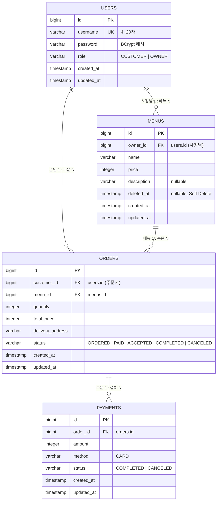

# ERD

GitHub에서 Mermaid로 바로 렌더링된다. 1:N 관계에서는 **N 쪽 테이블이 FK를 가진다.**

## 설계 결정

| 결정 | 이유 |
| --- | --- |
| 테이블명 `users`, `orders` (복수형) | `user`, `order`는 PostgreSQL 예약어라 쿼리가 깨진다. 4개 테이블 모두 복수형으로 통일한다. |
| 가게(Store) 테이블 없음 | 과제 전제: 가게 = 사장님 한 명. 메뉴가 `owner_id`로 사장님을 직접 가리킨다. |
| 주문에 사장님 FK 없음 | "본인 메뉴에 들어온 주문"은 `orders.menu_id → menus.owner_id`로 구한다. 같은 정보를 두 곳에 두지 않는다. |
| Soft Delete는 `deleted_at` | boolean 하나보다 "언제 지웠는지"까지 남아 이력에 유리하다. `NULL`이면 정상, 값이 있으면 삭제됨. |
| 금액은 `integer` (원 단위) | 원화는 소수점이 없고, 과제 규모에서 int 범위(약 21억)로 충분하다. |
| 총액·결제 금액은 서버 계산 | 총액 = 메뉴 가격 × 수량을 주문 시점에 저장한다. 결제 금액은 주문 총액을 그대로 복사한다. 이후 메뉴 가격이 바뀌어도 기존 주문 총액은 유지된다. |
| 결제 : 주문 = N : 1 | 결제 취소 후 재결제를 위해 한 주문에 결제 기록이 여러 건 쌓일 수 있다. 단 `COMPLETED`는 주문당 한 번만 허용하며, 서비스에서 주문 상태(`ORDERED`일 때만 결제 가능)로 막는다. |
| 메뉴 스냅샷 컬럼 없음 | 필수 범위에서는 생략. 주문이 메뉴 FK를 유지하고 Soft Delete로 행을 보존하므로 주문 기록이 깨지지 않는다. 가격 변경 이력까지 보여줘야 하면 후속 과제로 `menu_name`, `menu_price`를 주문에 복사한다. |
| enum은 모두 `STRING` 저장 | ORDINAL은 enum 순서가 바뀌면 기존 데이터 의미가 달라진다. |
